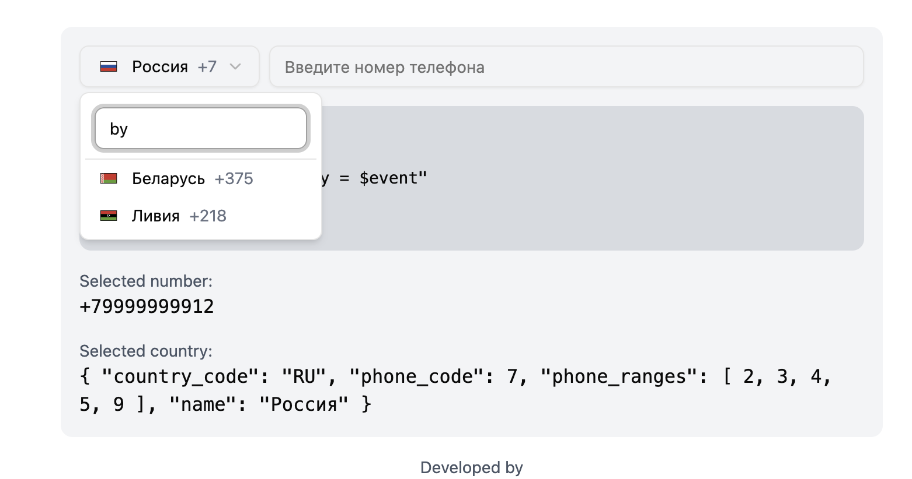

# Phone Select

Vue 3 component for phone number selection with international support and masking.

## Installation

### NPM
```bash
npm install alexbednov-phone-select
```

### Bun
```bash
bun add alexbednov-phone-select
```

## Screenshots

<table>
  <tr>
    <td width="50%">
      <h3>Main View</h3>
      
    </td>
    <td width="50%">
      <h3>Country Selection</h3>
      
    </td>
  </tr>
</table>

### Supported Languages

<table>
  <tr>
    <td width="50%">
      <h4>English</h4>
      
    </td>
    <td width="50%">
      <h4>Русский</h4>
      
    </td>
  </tr>
  <tr>
    <td width="50%">
      <h4>Беларуская</h4>
      
    </td>
    <td width="50%">
      <h4>Azərbaycan</h4>
      
    </td>
  </tr>
</table>

### Features

<table>
  <tr>
    <td width="50%">
      <h3>Search by Country Name</h3>
      
    </td>
    <td width="50%">
      <h3>Search by Country Code</h3>
      
    </td>
  </tr>
  <tr>
    <td width="50%">
      <h3>Search by Phone Code</h3>
      
    </td>
    <td width="50%">
      <h3>Favorite Countries</h3>
      
    </td>
  </tr>
  <tr>
    <td width="50%">
      <h3>Phone Number Masking</h3>
      
    </td>
    <td width="50%"></td>
  </tr>
</table>

## API

### Core Functions

```typescript
import {
  getCountries,
  getCountryByCode,
  getCountryByName,
  getCountryByPhoneCode,
  getFlagPath,
  getAllCountryNames
} from 'alexbednov-phone-select'

// Get list of all countries
const allCountries = getCountries('en') // Supports: ru, en, az, be

// Find country by code
const country = getCountryByCode('us') // United States

// Find country by name
const country = getCountryByName('United States')

// Find country by phone code
const country = getCountryByPhoneCode(1) // United States

// Get flag path
const flagPath = getFlagPath('us') // /src/assets/flags/us.svg

// Get all country names in different languages
const names = getAllCountryNames('us') // ['United States', 'США', ...]
```

### Types

```typescript
interface Country {
  country_code: string
  phone_code: number
  name?: string
  phone_ranges?: number[]
}

type Language = 'ru' | 'en' | 'az' | 'be'
```

### Localization

```typescript
import { loadTranslations } from 'alexbednov-phone-select'

const translations = loadTranslations()
// Available translations: ru, en, az, be
```

## Vue Component

```vue
<script setup lang="ts">
import { PhoneSelect } from 'alexbednov-phone-select'
</script>

<template>
  <PhoneSelect
    v-model="phoneNumber"
    :lang="lang"
    :favorites-countries="['us', 'gb']"
    :enable-mask="true"
    :enable-search="true"
    :hide-favorites="false"
    :disable-country-name-select="false"
    :disable-auto-parse-number="false"
    select-class="w-[180px]"
    input-class="flex-1"
    select-placeholder="Select country"
    input-placeholder="Enter phone number"
    select-content-class=""
    select-trigger-class=""
    select-value-class=""
    select-item-class=""
    select-item-country-class=""
  />
</template>
```

### Component Props

- `v-model` - full phone number with country code
- `lang` - interface language (ru, en, az, be)
- `favorites-countries` - array of favorite country codes
- `hide-favorites` - hide favorite countries (default: true)
- `enable-search` - enable country search (default: false)
- `enable-mask` - enable number masking (default: false)
- `disable-country-name-select` - disable country name display in select (default: false)
- `disable-auto-parse-number` - disable automatic number parsing (default: false)
- `select-class` - select element classes
- `input-class` - input element classes
- `select-placeholder` - select placeholder text
- `input-placeholder` - input placeholder text
- `select-content-class` - select content classes
- `select-trigger-class` - select trigger classes
- `select-value-class` - select value classes
- `select-item-class` - select item classes
- `select-item-country-class` - country item classes in select

### Events

- `update:modelValue` - phone number update
- `update:country` - selected country update

## Features

- Phone number masking
- Country search (code, name, phone code)
- Favorite countries
- Customization through classes
- Automatic number parsing
- Localization (ru, en, az, be)
- Dark theme support
- Responsive design

## Based on

Country list and flags from [react-phone-country-code-flag](https://github.com/markliu2013/react-phone-country-code-flag/tree/main)

## License

MIT

---

# Phone Select [RU]

Vue 3 компонент для выбора телефонных номеров с международной поддержкой и маскированием.

## Скриншоты

<table>
  <tr>
    <td width="50%">
      <h3>Основной вид</h3>
      
    </td>
    <td width="50%">
      <h3>Выбор страны</h3>
      
    </td>
  </tr>
</table>

### Поддерживаемые языки

<table>
  <tr>
    <td width="50%">
      <h4>English</h4>
      
    </td>
    <td width="50%">
      <h4>Русский</h4>
      
    </td>
  </tr>
  <tr>
    <td width="50%">
      <h4>Беларуская</h4>
      
    </td>
    <td width="50%">
      <h4>Azərbaycan</h4>
      
    </td>
  </tr>
</table>

### Функциональность

<table>
  <tr>
    <td width="50%">
      <h3>Поиск по названию страны</h3>
      
    </td>
    <td width="50%">
      <h3>Поиск по коду страны</h3>
      
    </td>
  </tr>
  <tr>
    <td width="50%">
      <h3>Поиск по телефонному коду</h3>
      
    </td>
    <td width="50%">
      <h3>Избранные страны</h3>
      
    </td>
  </tr>
  <tr>
    <td width="50%">
      <h3>Маскирование номера</h3>
      
    </td>
    <td width="50%"></td>
  </tr>
</table>

## Установка

### NPM
```bash
npm install alexbednov-phone-select
```

### Bun
```bash
bun add alexbednov-phone-select
```

## API

### Основные функции

```typescript
import {
  getCountries,
  getCountryByCode,
  getCountryByName,
  getCountryByPhoneCode,
  getFlagPath,
  getAllCountryNames
} from 'alexbednov-phone-select'

// Получить список всех стран
const allCountries = getCountries('ru') // Поддерживает языки: ru, en, az, be

// Найти страну по коду
const country = getCountryByCode('ru') // Россия

// Найти страну по названию
const country = getCountryByName('Russia') // Россия

// Найти страну по телефонному коду
const country = getCountryByPhoneCode(7) // Россия

// Получить путь к флагу страны
const flagPath = getFlagPath('ru') // /src/assets/flags/ru.svg

// Получить все названия страны на разных языках
const names = getAllCountryNames('ru') // ['Россия', 'Russia', ...]
```

### Типы

```typescript
interface Country {
  country_code: string
  phone_code: number
  name?: string
  phone_ranges?: number[]
}

type Language = 'ru' | 'en' | 'az' | 'be'
```

### Локализация

```typescript
import { loadTranslations } from 'alexbednov-phone-select'

const translations = loadTranslations()
// Доступные переводы: ru, en, az, be
```

## Vue компонент

```vue
<script setup lang="ts">
import { PhoneSelect } from 'alexbednov-phone-select'
</script>

<template>
  <PhoneSelect
    v-model="phoneNumber"
    :lang="lang"
    :favorites-countries="['by', 'ru']"
    :enable-mask="true"
    :enable-search="true"
    :hide-favorites="false"
    :disable-country-name-select="false"
    :disable-auto-parse-number="false"
    select-class="w-[180px]"
    input-class="flex-1"
    select-placeholder="Выберите страну"
    input-placeholder="Введите номер"
    select-content-class=""
    select-trigger-class=""
    select-value-class=""
    select-item-class=""
    select-item-country-class=""
  />
</template>
```

### Пропсы компонента

- `v-model` - полный номер телефона с кодом страны
- `lang` - язык интерфейса (ru, en, az, be)
- `favorites-countries` - массив кодов избранных стран
- `hide-favorites` - скрыть избранные страны (по умолчанию true)
- `enable-search` - включить поиск по странам (по умолчанию false)
- `enable-mask` - включить маскирование номера (по умолчанию false)
- `disable-country-name-select` - отключить отображение названия страны в селекте (по умолчанию false)
- `disable-auto-parse-number` - отключить автоматический парсинг номера (по умолчанию false)
- `select-class` - классы для селекта
- `input-class` - классы для инпута
- `select-placeholder` - плейсхолдер для селекта
- `input-placeholder` - плейсхолдер для инпута
- `select-content-class` - классы для контента селекта
- `select-trigger-class` - классы для триггера селекта
- `select-value-class` - классы для значения селекта
- `select-item-class` - классы для элемента селекта
- `select-item-country-class` - классы для элемента страны в селекте

### События

- `update:modelValue` - обновление номера телефона
- `update:country` - обновление выбранной страны

## Особенности

- Поддержка маскирования номеров
- Поиск по странам (код, название, телефонный код)
- Избранные страны
- Кастомизация через классы
- Автоматический парсинг номера
- Локализация (ru, en, az, be)
- Поддержка темной темы
- Адаптивный дизайн

## Основано на

Список стран и флагов из репозитория [react-phone-country-code-flag](https://github.com/markliu2013/react-phone-country-code-flag/tree/main)

## Лицензия

MIT
